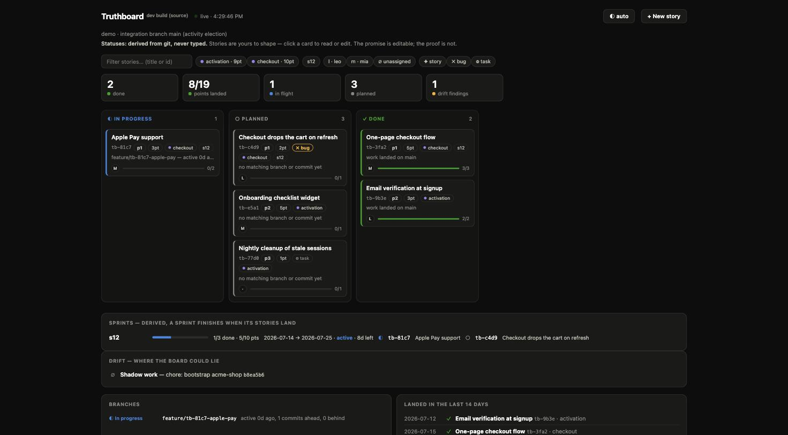
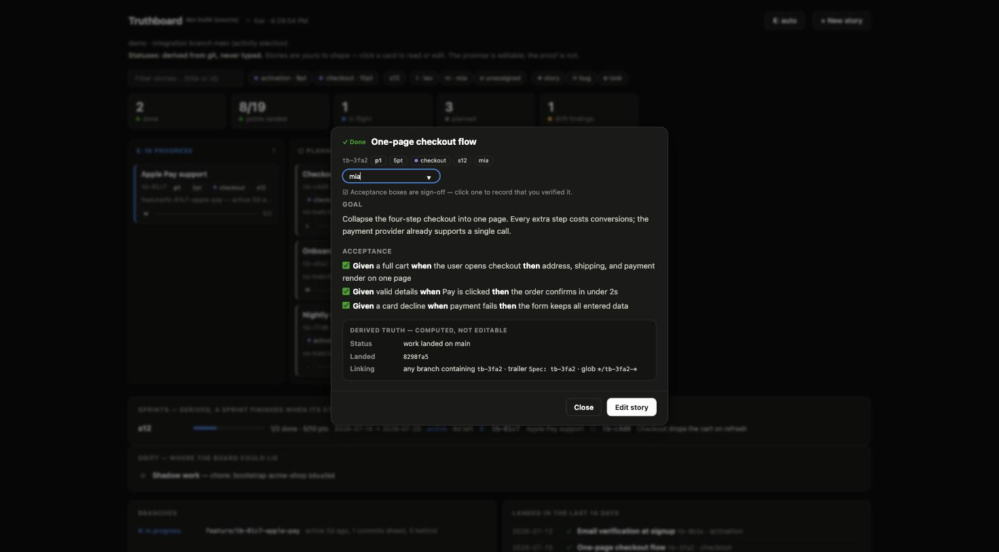

# Truthboard

**Your repo already knows the status. Stop typing it twice.**

Truthboard is a git-native tracker with one rule: **status is derived from
repo reality, never typed by hand.** Humans and AI agents write down *intent*
once — a small markdown spec — and the board, drift report, and stakeholder
digest are computed from branches, merges, and commit trailers. On repos with
no specs it runs as a pure read-only auditor, and either way it can check
your existing tracker's claims against what the repo proves.

## What it looks like



Every status on this board was computed, not typed. **Apple Pay support**
is *in progress* because a branch carrying its id has commits;
**One-page checkout flow** is *done* because its work landed on main —
the card's evidence line says so. Cards carry the story's intent: priority,
points, `bug`/`task` type badges, epic and sprint tags, and the owner's
avatar. The filter row totals points per epic, and the sprint panel is
pure arithmetic plus a date window: `s12 · 1/3 done · 5/10 pts ·
2026-07-14 → 2026-07-25 · active, 8d left` — nothing there can be edited,
because none of it is an opinion.



A story opens into its intent — goal and Given/When/Then acceptance,
where checking a box records *human sign-off*, deliberately separate from
delivery — followed by the **derived truth** panel: the status, the
commit that landed it, and every signal that links work to this spec.
The promise is editable; the proof is not.

## Install

```sh
curl -fsSL https://raw.githubusercontent.com/emmanuel-D/truthboard/main/install.sh | sh
```

The script picks the right build for your platform (macOS/Linux,
amd64/arm64), verifies it against the release checksums, and installs to
`/usr/local/bin` or `~/.local/bin` — no sudo. Homebrew works too:

```sh
brew install emmanuel-D/truthboard/truthboard
```

Or grab a tarball from
[Releases](https://github.com/emmanuel-D/truthboard/releases) yourself
(Windows lives there), or build from source:

```sh
go install github.com/emmanuel-D/truthboard/cmd/truthboard@latest
```

Single static binary; the only runtime dependency is `git`. Optional:
`gh`/`glab` for tracker claims, `npm` for package scripts.

Stay current with `truthboard update` (`--check` to only look): it
verifies the download against the release checksums and swaps the binary
atomically. Detached boards keep running the old binary until you
`truthboard stop && truthboard ui --detach` — the board's footer shows
which version is serving it.

## Quick start in an existing project

```sh
cd your-project
truthboard init --agents --hooks   # specs + MCP + AGENTS.md + trailer nudge
truthboard ui --detach             # the board, running in the background
```

That's the whole setup. Write your first story (`truthboard spec new` or
the board's **+ New story**), work on a branch containing its id, and the
card moves itself. In npm projects, init also wires `npm run board`,
`board:status`, `board:stop`, and `board:audit`.

## Spec mode — the tracker

```sh
truthboard init                             # opt in: creates .truthboard/specs/
truthboard spec new "Add email verification" --owner emmanuel
truthboard brief tb-4f2a                    # context packet for an AI agent (or a human)
truthboard next                             # highest-priority planned story, as a brief —
                                            # "start the next story" is one deterministic call
truthboard audit                            # spec board + drift + digest, all derived
truthboard link tb-4f2a "hotfix/*"          # fix a linking miss — fixes the input, never the status
```

A spec is one markdown file (YAML frontmatter + Goal/Acceptance body),
versioned with your code. Backlog structure is intent too:

- `epic` groups stories, `priority` (1/2/3) orders them, `type` marks a
  story, `bug`, or `task` (badges and filters follow), and `points` is an
  optional estimate — sprint and epic rollups then count points done vs
  planned, with unestimated stories counted distinctly, never as zero.
- `sprint` (e.g. `--sprint s12`) puts a story in an iteration; the audit,
  reports, and board show a per-sprint rollup (done/total, points, what's
  still open). Give a sprint a calendar window with an intent file —
  `.truthboard/sprints/s12.md` with `start:`/`end:` dates — and its
  future/active/completed state and days remaining are derived from the
  dates. There is still no sprint status to set: a sprint finishes when
  its stories land.
- `needs: [tb-1a2b]` declares prerequisites. Readiness is derived: a story
  whose needs haven't all landed is *waiting* (shown on every surface),
  `truthboard next` skips it, and a dependency cycle is a loud drift
  finding, never a silent skip.

Linking signals, strongest first: a `Spec: tb-4f2a`
commit trailer, the id in a branch name, the spec's branch glob. Derived
statuses: `planned → in-progress → in-review → done` (plus `stalled`), and a
done spec loudly becomes `regressed` when its landed work is reverted or CI
goes red on the landing commit — without CI data the tool says nothing
rather than guessing. There is no command to set a status — that's the
product.

## MCP — agents as first-class citizens

`truthboard mcp` serves the spec layer over the Model Context Protocol
(stdio, JSON-RPC 2.0), so agents stop shelling out. There is nothing
Claude-specific in it: any MCP-capable client works — Claude Code is one
of them, not the requirement. `truthboard adopt` registers the server in
the project's `.mcp.json`, which Claude Code picks up automatically;
other tools want the same one-liner in their own config:

```sh
# Claude Code
claude mcp add truthboard -- truthboard mcp
```

```json
// Cursor — .cursor/mcp.json
{ "mcpServers": { "truthboard": { "command": "truthboard", "args": ["mcp"] } } }
```

```toml
# Codex CLI — ~/.codex/config.toml
[mcp_servers.truthboard]
command = "truthboard"
args = ["mcp"]
```

```json
// Gemini CLI — .gemini/settings.json
{ "mcpServers": { "truthboard": { "command": "truthboard", "args": ["mcp"] } } }
```

The working agreement travels the same way: it lives in `AGENTS.md`, the
cross-tool convention that Codex, Cursor, Gemini CLI and friends already
read — `CLAUDE.md` exists only to import it for Claude Code. Point your
tool at the server and the agreement is already there.

Tools: `list_specs`, `get_brief` (the context packet to start work),
`next_spec` (the highest-priority *startable* story — an idle agent needs
no human to pick, and is never handed a story whose dependencies haven't
landed), `create_spec`, `update_spec`, `get_board`. Deliberately absent:
any tool that sets a status — an agent's work shows up on the board the
same way a human's does, through commits with the spec trailer.

## Terminal board — the same truth, no browser

```sh
truthboard board
```

A read-only Bubbletea TUI: kanban columns, arrow/vim navigation, enter
for a story's goal and acceptance, `e`/`s`/`a` to cycle epic, sprint, and
owner filters, `d`/`g` for the drift report and digest. Refreshes itself;
`q` quits. No keybinding writes anything, because there is nothing to set.

## LLM assist — optional, explicit, never a source of truth

With `ANTHROPIC_API_KEY` (Anthropic API) or `OLLAMA_HOST` (local Ollama)
set — `TRUTHBOARD_LLM_MODEL` overrides the model — two commands light up:

```sh
truthboard draft "usage-based billing for teams"   # concept → epic of real stories
truthboard review s12                              # narrated sprint review
```

`draft` writes fully-formed specs (goal + Given/When/Then acceptance)
through the same files a human would edit, and refuses placeholder
stories. `review` narrates a sprint — or the whole digest window — strictly
from derived facts: the LLM is a writer, never a source. Nothing calls a
model unless one of these two commands is explicitly invoked.

## Web board — for the people who used to ask "what's the status?"

```sh
truthboard ui              # opens http://127.0.0.1:1337, auto-refreshing
truthboard ui --forge      # include tracker claims (slower refresh)
truthboard ui --detach     # keep it running in the background
truthboard ui --fetch 60s  # poll origin so the board tracks the remote
truthboard ui --notify <url>  # post stalled/regressed transitions to a webhook
truthboard status          # is a board running for this repo?
truthboard stop            # stop the detached board
```

Detached boards are per-repo: state lives inside `.git/` (never
committed), no system services, no root.

In npm projects, `truthboard init` also wires these as package scripts —
`npm run board`, `board:status`, `board:stop`, `board:audit` — via
`npm pkg set`, never touching your existing scripts.

A live page rendering the spec board, branches, drift, and digest — and
where POs create and refine stories: click a card to edit its title, goal,
acceptance, epic, and priority. **The promise is editable; the proof is
not:** intent edits write the markdown spec files (a plain git diff, with
an uncommitted-changes nudge on the page), while statuses stay computed
with no route by which anything could set one. The page ships as embedded
static assets via go:embed — still one binary, no build step.

With `--notify` (or `TRUTHBOARD_NOTIFY_URL`), the board also tells people
when the truth changes for the worse: a story transitioning into
`stalled` or `regressed` — or recovering back out — posts one
Slack-compatible message carrying the audit's evidence line. First sight
is baseline, steady state is silent, and the seen-state lives in `.git/`
per clone.

### Multi-machine: a board that tracks the remote

The board derives everything from the local clone, so by default it is
only as fresh as your last `git fetch`. When the machine showing the board
is not the machine doing the work — a PO's laptop, a shared box — add
`--fetch`:

```sh
truthboard ui --detach --fetch 60s
```

Remote-tracking refs refresh unconditionally, so branch statuses, drift,
and the digest track the remote with no local git use. Spec files are
intent and live in the working tree, so the checkout is fast-forwarded
only when it is clean and on the integration branch — uncommitted work is
never touched, and the page says loudly when refs are fresh but story
files are not (or when fetching fails).

To give the whole team one URL, bind beyond loopback:

```sh
truthboard ui --detach --fetch 60s --host 0.0.0.0 --no-open
```

A board served beyond loopback is read-only by default: it shows the
truth; intent editing stays a same-machine (clone) privilege. To write
stories from anywhere — a phone on the road — arm an edit token
(`--edit-token` / `TRUTHBOARD_EDIT_TOKEN`): writes carrying the token
are committed to the server's clone and pushed to origin by the board
itself, so `git pull && truthboard next` (or an agent's `next_spec`)
picks them up at home. The token opens the promise, never the proof —
statuses stay derived. `truthboard status` reports the fetch interval
and shared host.

For a board that updates the moment work lands instead of on the next
poll, arm the push webhook: `--webhook-secret <secret>` (or
`TRUTHBOARD_WEBHOOK_SECRET`) enables `POST /webhook` — point a GitHub
(HMAC signature) or GitLab (`X-Gitlab-Token`) push webhook at it and a
push triggers an immediate fetch + re-derive, with open browsers updating
instantly over server-sent events. Bad or missing secrets are rejected in
constant time and logged; the endpoint can only make the board fresher,
never change what it says.

To put a board like this on a real server — EC2 or any VPS under
systemd, Docker (the repo ships a `Dockerfile`), or a PaaS like Coolify —
follow [docs/deploy.md](docs/deploy.md).

### Multi-repo: one board over N repositories

When a project spans several repos, one of them (or a dedicated planning
repo) becomes the **hub**: it carries `.truthboard/` — every spec, plus a
workspace manifest listing the other repos:

```yaml
# .truthboard/workspace.yml
repos:
  api:
    remote: git@github.com:acme/api.git
    integration: main
  web:
    remote: git@github.com:acme/web.git
```

Intent lives in the hub; proof is gathered from every declared spoke. The
board server mirror-clones and fetch-syncs each spoke, branches render as
`api:feature/tb-1234-…`, and a `Spec:` trailer landing on a spoke's
integration branch flips the story to done exactly like a hub landing —
while active work in *any* repo outranks a landing in another. A spoke
the audit cannot see is a loud finding, never a silent omission.

A story that must land in several repos declares it — `repos: [api, web]`
(`hub` names the hub itself) — and is done only when the trailer landed in
every one, with per-repo evidence in the meantime: `api ✓ landed · web —
no branch yet`. A revert in any declared repo regresses it. Details in
[docs/multi-repo.md](docs/multi-repo.md).

## Audit mode — works on any repo, no specs needed

```sh
truthboard audit ~/dev/some-repo  # board + drift + digest from git alone
truthboard audit --format md      # markdown (for a weekly drift issue)
truthboard audit --format json    # machine-readable (for CI/automation)
```

What it reports:

- **Derived board** — every non-integration branch classified as
  `in-review`, `in-progress`, `stalled`, or `done` (merge detected by
  ancestry *or* patch-equivalence, so squash/rebase merges are caught).
- **Drift** — stale promises (work that stopped without landing), shadow work
  (commits that bypassed any branch/MR flow), zombie branches (landed but
  never deleted), and a misconfigured remote default branch if it spots one.
- **Claims vs proof** — when the repo is on GitHub and `gh` is available, the
  tracker's claims are checked against the repo: assigned tickets with no
  matching activity, tickets whose fix already landed but are still open,
  branches with no ticket and no PR, PRs closed without merging. Unassigned
  open issues are backlog, not claims — they are never flagged.
- **Digest** — what actually landed recently, readable by a non-developer.

Git evidence always outranks tracker claims: enrichment can upgrade a branch
to `in-review`, but nothing a tracker says can un-merge a merged branch.

## GitHub Action

Maintain a recurring drift-report issue, updated in place on a schedule:

```yaml
name: Truthboard
on:
  schedule:
    - cron: '0 8 * * 1'
  workflow_dispatch:
permissions:
  contents: read
  issues: write
  pull-requests: read
jobs:
  drift:
    runs-on: ubuntu-latest
    steps:
      - uses: actions/checkout@v4
        with:
          fetch-depth: 0 # full history — the audit reads branch/merge topology
      - uses: emmanuel-D/truthboard@main
```

Inputs: `stale-days` (default 7), `digest-days` (default 14), `issue-title`
(default "Truthboard drift report"), `github-token` (defaults to the workflow
token). The action never blocks, labels, or closes anything.

## Build

```sh
go build ./cmd/truthboard
go test ./...
```

Single static binary, no runtime dependencies beyond `git` itself.

## License

MIT — see [LICENSE](LICENSE).

## Status

`v0.6.0` released (deployable shared board: Dockerfile, edit-token remote
intent editing); multi-repo workspaces — one board over N repositories,
with `repos:` cross-repo done semantics — landed on `main` and ship with
the next tag. Built as the [CONCEPT-V1.md](CONCEPT-V1.md) spec-driven
tracker on the [CONCEPT-V2.md](CONCEPT-V2.md) audit engine; the inference
logic was validated at 100% done-vs-not-done accuracy against GitHub PR
state on real repos before being ported to Go (CONCEPT-V1 §11).
Truthboard tracks its own roadmap in `.truthboard/specs/` — run
`truthboard audit` on this repo to see the board this README describes,
derived live.
