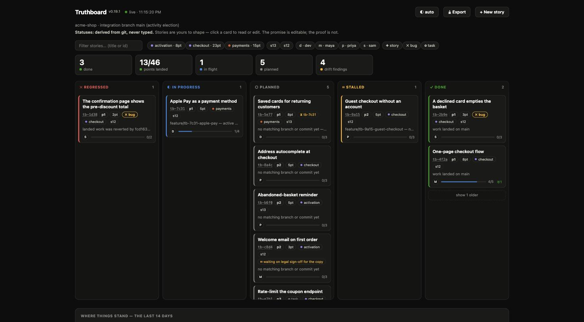
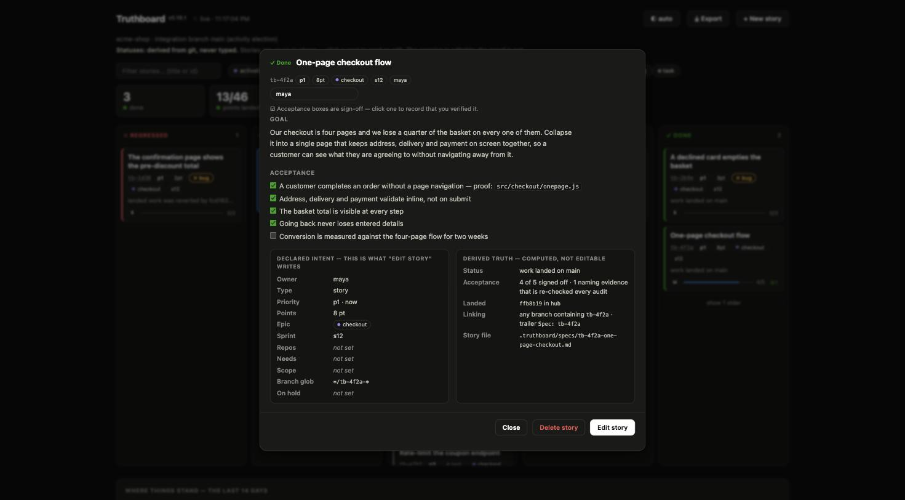
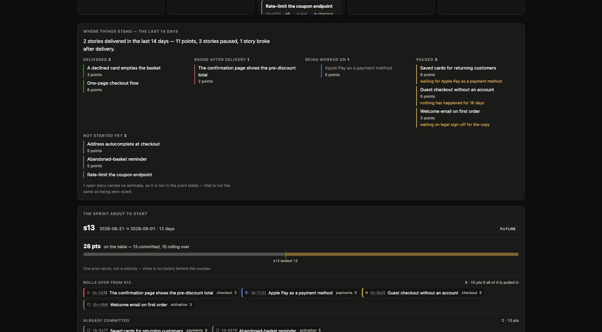

# Truthboard

**Your repo already knows the status. Stop typing it twice.**

Truthboard is a git-native tracker with one rule: **status is derived from
repo reality, never typed by hand.** Humans and AI agents write down *intent*
once — a small markdown spec — and the board, drift report, and stakeholder
digest are computed from branches, merges, and commit trailers. On repos with
no specs it runs as a pure read-only auditor, and either way it can check
your existing tracker's claims against what the repo proves.

**Start here** — [what it looks like](#what-it-looks-like) ·
[install](#install) · [your first five minutes](#your-first-five-minutes) ·
[spec mode](#spec-mode--the-tracker) · [audit mode, no setup](#audit-mode--works-on-any-repo-no-specs-needed)

<details>
<summary><b>Everything else</b> — the rest of this page, by what you came for</summary>

| You want to… | Section |
| --- | --- |
| See it before installing | [What it looks like](#what-it-looks-like) |
| Install it | [Install](#install) · [Quick start](#quick-start-in-an-existing-project) |
| Know what the first commands print | [Your first five minutes](#your-first-five-minutes) |
| Write and track stories | [Spec mode](#spec-mode--the-tracker) |
| Point an AI agent at it | [MCP](#mcp--agents-as-first-class-citizens) |
| Run it on a repo with no specs | [Audit mode](#audit-mode--works-on-any-repo-no-specs-needed) |
| Plan a sprint, brief a stakeholder | [Sprint planning and the summary](#sprint-planning-and-the-stakeholder-summary) |
| Know how long work actually takes | [Flow](#flow--how-long-work-actually-takes-timed-by-git) |
| Prove a sign-off can be re-checked | [Evidence](#evidence-a-tick-that-can-be-re-checked) |
| Arrive with an existing backlog | [Import](#import--arriving-with-a-backlog-you-already-have) |
| Publish the board as issues | [Mirror](#mirror--for-the-people-who-never-open-a-terminal) |
| Answer "what changed since…?" | [What changed since](#what-changed-since--the-standup-question) |
| Stay in the terminal | [Terminal board](#terminal-board--the-same-truth-no-browser) |
| Share a board with the team | [Web board](#web-board--for-the-people-who-used-to-ask-whats-the-status) · [multi-machine](#multi-machine-a-board-that-tracks-the-remote) |
| Cover several repos at once | [Multi-repo](#multi-repo-one-board-over-n-repositories) |
| Run it in CI | [GitHub Action](#github-action) |
| Use an LLM (optional) | [LLM assist](#llm-assist--optional-explicit-never-a-source-of-truth) |

</details>

## What it looks like

Every picture below is a live board over a demo shop — `acme-shop`, three
epics and two sprints, rebuilt from nothing by
[`docs/demo/build-demo-repo.sh`](docs/demo/build-demo-repo.sh) so you can
run the same commands against the same repo and get the same answers.



**Nobody moved a card onto this board.** *Apple Pay* sits in progress
because a branch carrying its id has commits; *One-page checkout flow* is
done because its work reached `main`; *The confirmation page shows the
pre-discount total* is red because the commit that landed it was reverted,
and the card names the revert. *Guest checkout* went stalled by itself
after sixteen silent days. There is no command that sets any of those, so
none of them can be wrong on purpose.

Two chips are the exception that proves the rule, because they are the
things git cannot know. *Welcome email* carries **waiting on legal sign-off
for the copy** — a person wrote that, because history can prove work
stopped and never why. *Saved cards* carries **⚡ tb-7c31**: it declared a
prerequisite, so it is not startable, and the next agent asking for work
will be handed something else.

The bars are acceptance, and they are deliberately not status. *A declined
card* landed at **0/3** — delivered with a promise nobody read back, which
is why the drift tile counts 4. *One-page checkout* reads **4/5 ⛨1**: four
criteria signed off, one of them naming evidence that gets re-checked on
every audit.



**This is the whole argument in one dialog.** The left panel is *declared
intent* — owner, points, epic, sprint, priority, the branch glob — every
field a human types, all of it editable. The right panel is *derived
truth*, and it has no edit control anywhere because there is nothing there
to set: the status is `work landed on main`, the landing is commit
`ffb8b19`, and the linking line says exactly how this work was recognised
as this story. Acceptance sits above both, because signing off a promise
is a human claim about the world, not a fact about the repository — and
one criterion here names `src/checkout/onepage.js` as its proof, so if
that file disappears the audit says so rather than letting the tick
outlive it.



**The two views nobody needs a terminal for.** *Where things stand*
answers the standup in the language of someone who does not read git —
delivered, being worked on, paused, not started — and every paused story
carries the reason with the most standing: a human's hold note, else the
title of the story blocking it, else how long it has been quiet. The
footnote is the honesty: one story has no estimate, so it is missing from
the point totals rather than silently counted as zero.

*The sprint about to start* is the planning meeting, derived. It shows
what rolls over, what is already committed, and the load — `28 pts on the
table` against `s12 landed 13`. Under the bar it says **one prior sprint,
not a velocity**, because that is one data point, and a tool that turned
it into a forecast would be typing a status by other means.

## Install

**Recommended — the install script:**

```sh
curl -fsSL https://raw.githubusercontent.com/emmanuel-D/truthboard/main/install.sh | sh
truthboard update            # later, to stay current (--check to only look)
```

It picks the right build for your platform (macOS/Linux, amd64/arm64),
verifies it against the release checksums, and installs to
`/usr/local/bin` or `~/.local/bin` — no sudo. It is also the path
`truthboard update` keeps current: the same checksum verification, and an
atomic swap of the binary in place.

**Homebrew**, if you would rather your package manager owned it:

```sh
brew install emmanuel-D/truthboard/truthboard
brew upgrade truthboard      # this is the update path — not `truthboard update`
```

Brew owns that binary, so brew updates it: `truthboard update` recognises
a keg and points you back here rather than writing into the Cellar, where
brew would keep reporting the old version and revert you on its next
upgrade.

Or grab a tarball from
[Releases](https://github.com/emmanuel-D/truthboard/releases) yourself
(Windows lives there), or install with Go:

```sh
go install github.com/emmanuel-D/truthboard/cmd/truthboard@latest
```

That one carries its version like a release install, so `truthboard
update` keeps it current too. A binary built from a *checkout* reports
`dev` and is deliberately never replaced — `update` points you at
`git pull` instead, so nobody's working copy is overwritten.

Single static binary; the only runtime dependency is `git`. Optional:
`gh`/`glab` for tracker claims, `npm` for package scripts.

However you update, detached boards keep running the old binary until you
`truthboard stop && truthboard ui --detach` — the board's footer shows
which version is serving it.

## Quick start in an existing project

```sh
cd your-project
truthboard init --agents --hooks   # specs + MCP + AGENTS.md + trailer nudge
truthboard ui --detach             # the board, running in the background
```

That's the whole setup. Write your first story (`truthboard spec new` or
the board's **+ New story**), work on a branch containing its id, and the
card moves itself. In npm projects, init also wires `npm run board`,
`board:status`, `board:stop`, and `board:audit`.

## Your first five minutes

What the commands above actually print, in order, on a repository that has
never seen this tool. Nothing here is abridged.

**1. Adoption tells you every file it touched.** It writes inside your
repo and nowhere else, so the whole change is reviewable in a diff — and
it hands you the commit rather than making it, because wiring is intent
and intent gets reviewed like code:

```console
$ truthboard init --agents --hooks
initialized .truthboard/specs
  package.json: none, npm scripts skipped
  .mcp.json: registered the truthboard MCP server
  .vscode/mcp.json: registered the truthboard MCP server (VS Code / GitHub Copilot)
  AGENTS.md: working agreement written
  CLAUDE.md: agreement import written
  commit-msg hook: installed (warns on missing trailer, never blocks)
  this wiring is intent — commit it like code (or re-run with --commit):
    git add .truthboard .mcp.json .vscode/mcp.json AGENTS.md CLAUDE.md && git commit -m "Track work with truthboard"

Next:
  truthboard spec new "Your first unit of work"   write intent once
  truthboard audit                                 everything else is derived
```

**2. A story is one markdown file, and you are told how to link work to
it.** Three ways, strongest first — you only ever need one:

```console
$ truthboard spec new "Add email verification" --owner emmanuel --points 3
created .truthboard/specs/tb-e0f7-add-email-verification.md

  id:      tb-e0f7
  branch:  */tb-e0f7-* (suggested glob — any branch containing "tb-e0f7" links too)
  trailer: Spec: tb-e0f7 (add to commits for the strongest link)

Edit the Goal and Acceptance sections, then: truthboard brief tb-e0f7
```

Open that file and fill in the Goal and the Acceptance checklist. That is
the *only* typing this tool asks of you. There is no status field in it,
and no command that would set one.

**3. Everything else is computed.** Work on a branch with the id in its
name, end your commits with `Spec: tb-e0f7`, and `truthboard audit` reads
the repository back to you. Run against the demo shop, it prints:

```console
$ truthboard audit
TRUTHBOARD AUDIT  .
integration branch: main (via activity election)

SPEC BOARD (intent from .truthboard/specs — status derived, never typed)
  REGRESSED    tb-1d38 The confirmation page shows the pre-discount total · p1 · checkout · s12
    landed work was reverted by fcd1636 (reverts 265aaaf)
  IN-PROGRESS  tb-7c31 Apple Pay as a payment method · p1 · payments · s12 [feature/tb-7c31-apple-pay]
    feature/tb-7c31-apple-pay — active 0d ago, 2 commits ahead, 0 behind
  PLANNED      tb-5e77 Saved cards for returning customers · p1 · payments · s13
    no matching branch or commit yet — waiting on tb-7c31
  STALLED      tb-9a15 Guest checkout without an account · p2 · checkout · s12 [feature/tb-9a15-guest-checkout]
    feature/tb-9a15-guest-checkout — no commits for 16 days (1 unmerged)
  DONE         tb-4f2a One-page checkout flow · p1 · checkout · s12
    work landed on main

SPRINTS (arithmetic over derived statuses — a sprint finishes when its stories land)
  s12  3/7 done · 13/28 pts · 2026-08-09 → 2026-08-20 · active, 5d left

DRIFT REPORT
  Stale promises (1): work that stopped without landing
    - feature/tb-9a15-guest-checkout: no commits for 16 days (1 unmerged)
  Unverified acceptance (2): landed work whose criteria were never ticked
    - tb-2b9e A declined card empties the basket — 0 of 3 criteria ticked
    - tb-4f2a One-page checkout flow — 4 of 5 criteria ticked
```

(Commit hashes and the day counts differ on your machine: the demo script
dates its history relative to the day you run it, so the board is always
mid-flight rather than frozen on the day it was recorded.)

Read the second line of every entry: each status arrives with the evidence
that produced it. That is the part you can check, and the reason you never
have to take the first line on trust.

**4. Nothing so far required a decision about tooling.** `truthboard ui`
puts the same thing in a browser for everyone who does not want a
terminal, `truthboard board` keeps it in one, and `truthboard mcp` hands
it to an AI agent. All three read the same derivation — there is no
second code path that could disagree.

Try it against the demo shop before your own repo:

```sh
docs/demo/build-demo-repo.sh /tmp/acme-shop   # a repo with a real history
truthboard audit /tmp/acme-shop
cd /tmp/acme-shop && truthboard ui
```

## Spec mode — the tracker

```sh
truthboard init                             # opt in: creates .truthboard/specs/
truthboard spec new "Add email verification" --owner emmanuel
truthboard brief tb-4f2a                    # context packet for an AI agent (or a human)
truthboard next                             # highest-priority planned story, as a brief —
                                            # "start the next story" is one deterministic call
truthboard check tb-4f2a 2                  # a criterion came true — tick it (also: a unique
                                            # substring, or "all"; --uncheck reverts)
truthboard audit                            # spec board + drift + digest, all derived
truthboard link tb-4f2a "hotfix/*"          # fix a linking miss — fixes the input, never the status
```

A spec is one markdown file (YAML frontmatter + Goal/Acceptance body),
versioned with your code. Backlog structure is intent too:

- `epic` groups stories, `priority` (1/2/3) orders them, `type` marks a
  story, `bug`, or `task` (badges and filters follow), and `points` is an
  optional estimate — sprint and epic rollups then count points done vs
  planned, with unestimated stories counted distinctly, never as zero.
- `sprint` (e.g. `--sprint s12`) puts a story in an iteration; the audit,
  reports, and board show a per-sprint rollup (done/total, points, what's
  still open). Give a sprint a calendar window with an intent file —
  `.truthboard/sprints/s12.md` with `start:`/`end:` dates — and its
  future/active/completed state and days remaining are derived from the
  dates. There is still no sprint status to set: a sprint finishes when
  its stories land.
- `needs: [tb-1a2b]` declares prerequisites. Readiness is derived: a story
  whose needs haven't all landed is *waiting* (shown on every surface),
  `truthboard next` skips it, and a dependency cycle is a loud drift
  finding, never a silent skip.
- `hold:` is why work is paused, in one human sentence — *"waiting on
  legal sign-off"*. Git can prove work stopped; it can never prove why,
  so this is the one field a person writes that no history would produce.
  It is intent, not a status: the story stays exactly as stalled or
  planned as git says it is. And git is allowed to argue back — a hold on
  work that has landed, or on work with fresh commits, is reported as
  **contradicted** everywhere the note appears and lands in the drift
  report. A reason can be wrong; it cannot be wrong silently. Clearing
  one is deleting the line — there is no "unhold".
- **Acceptance criteria** are the other half of done, and the half git
  cannot derive: a commit proves work landed, never that what was asked
  for came true. So ticking a criterion (`truthboard check tb-4f2a 2`, or
  `check_acceptance` over MCP) is intent as well — one line changed in the
  story file, committed with the same trailer. It sets nothing: a landed
  story reads done at 0/5. But a done story whose criteria were never
  ticked is reported as **unverified acceptance** in the drift report, on
  the board, and to the next agent that asks for work — because a promise
  nobody read back is the quietest way for a board to start lying.

Linking signals, strongest first: a `Spec: tb-4f2a`
commit trailer, the id in a branch name, the spec's branch glob. A commit
that touches nothing but intent — spec files, the wiring adoption writes —
links a story without landing it: filing one is not delivering it, so you
can add stories straight to the integration branch and they stay in the
backlog where you put them. Derived
statuses: `planned → in-progress → in-review → done` (plus `stalled`), and a
done spec loudly becomes `regressed` when its landed work is reverted or CI
goes red on the landing commit — without CI data the tool says nothing
rather than guessing. There is no command to set a status — that's the
product.

## MCP — agents as first-class citizens

`truthboard mcp` serves the spec layer over the Model Context Protocol
(stdio, JSON-RPC 2.0), so agents stop shelling out. There is nothing
Claude-specific in it: any MCP-capable client works — Claude Code is one
of them, not the requirement. Which *model* your client is driving —
Claude, GPT, whatever the picker offers — is equally irrelevant: MCP is a
property of the client, and the client hands your model the same nine
tools either way. `truthboard adopt` registers the server in **both**
committed config files — `.mcp.json` (Claude Code, and the shape Cursor
and friends read) and `.vscode/mcp.json` (VS Code, and so GitHub Copilot)
— so the two most common editors are wired by the same command. Every
other client wants the same one-liner in its own config, and one of them,
JetBrains, keeps that config outside the repo where no command of ours can
reach it:

```sh
# Claude Code
claude mcp add truthboard -- truthboard mcp
```

```json
// GitHub Copilot / VS Code — .vscode/mcp.json (written by init --agents)
// Note the key: VS Code spells it "servers", not "mcpServers".
{ "servers": { "truthboard": { "type": "stdio", "command": "truthboard", "args": ["mcp"] } } }
```

```json
// GitHub Copilot / JetBrains — ~/.config/github-copilot/intellij/mcp.json
// Same schema as VS Code, different home. Not written by any command.
{ "servers": { "truthboard": { "type": "stdio", "command": "truthboard", "args": ["mcp"] } } }
```

```json
// Cursor — .cursor/mcp.json
{ "mcpServers": { "truthboard": { "command": "truthboard", "args": ["mcp"] } } }
```

```toml
# Codex CLI — ~/.codex/config.toml
[mcp_servers.truthboard]
command = "truthboard"
args = ["mcp"]
```

```json
// Gemini CLI — .gemini/settings.json
{ "mcpServers": { "truthboard": { "command": "truthboard", "args": ["mcp"] } } }
```

The server takes an optional repository — `truthboard mcp [repo]` — and
this is the one command where that argument earns its keep, because an MCP
server runs in the directory its *client* chose. When the hub lives in a
subdirectory (the `init --workspace` layout) and agents are launched from
the workspace parent, point the server at it:

```json
{ "mcpServers": { "truthboard": { "command": "truthboard", "args": ["mcp", "./hub"] } } }
```

A relative path keeps the file portable — it is committed and shared, so
this machine's absolute paths do not belong in it. A path that is not a
git repository fails at startup with the same message every other command
gives, instead of starting and refusing every tool call afterwards.

### The board fits in a context window

`get_board` is the first call of every agent session, so its size is a
feature. The default answer carries **work in flight whole**, the top of
the backlog, and the most recently finished stories summarised to id,
title, status and tick counts — with an `omitted` block saying exactly
what was left out and how to ask for it. On this repo that is the
difference between 94,609 characters (refused by the client that asked
for it) and roughly 45,000.

It is *bounded*, not merely smaller: a backlog three times the size does
not produce a board three times as big, because every section has a
ceiling. Ask for more when you want it:

```jsonc
get_board {}                                   // the default, summarised
get_board {"status": ["in-progress","stalled"]} // just what is moving
get_board {"epic": "po-experience", "limit": 20}
get_board {"since": "2026-08-01"}              // touched since a date
get_board {"full": true}                       // every field of everything
```

The same narrowing works on the CLI — `truthboard audit --status
in-progress --format json`, `--full` for everything — so the two agree.
An unknown status or an unparseable date is an **error**, never a
silently ignored argument: getting the whole board back while believing
you asked for a slice of it is the one outcome worse than a board that is
too big.

And before filing anything, ask whether it exists already:

```sh
truthboard find "cycle time"     # CLI
```
```jsonc
find_spec {"query": "cycle time"}  // MCP — ids, titles, derived statuses
```

It searches ids, titles, epics and the stories' own text, and answers with
matches instead of the board. Filtering and searching only change what is
*shown*; every status they report is the same one git derives.

**An upgrade does not reach a server that is already running.** Your client
spawns `truthboard mcp` once and keeps that process for the session, so
after a `brew upgrade` the agent is still talking to the build it started
with — deriving statuses by rules a later release may have corrected, and
sounding exactly as confident about it. Restarting the client is what picks
up the new one. Truthboard says so rather than leaving you to find out: a
superseded server attaches a warning naming both versions to every answer
that carries a derived status (`get_board`, `next_spec`, `list_specs`,
`get_brief`, `find_spec`), and `truthboard status` lists any MCP server on this machine
older than the installed binary, next to the detached boards it already
reports. Both are warnings — a stale server keeps answering, because one
that refused would strand the session that needed it.

**JetBrains is the one editor no truthboard command can wire.** Copilot in
IntelliJ IDEA (and the rest of the JetBrains family) does not read the
repository's `.vscode/mcp.json` — its MCP config is a per-user,
per-machine file at `~/.config/github-copilot/intellij/mcp.json`, reached
in the IDE via the Copilot status-bar icon → Edit Settings → Model Context
Protocol → Configure. So `truthboard init --agents` wires everything for a
JetBrains shop *except* the connection itself: paste the snippet above
once per machine.

Adoption says so itself rather than leaving you to find out. A `.idea/`
directory in the repo — read from disk, so a gitignored one counts — makes
`init --agents` name that file and print the snippet, next to the wiring it
just wrote, with the hub spelled absolutely for you. It stays quiet when the
config already registers a truthboard server, and on any repo with no
`.idea/` in it. It never writes that file: everything adoption writes lands
inside the repo it was pointed at, reviewable in the diff and committed for
the team, and this one is yours. Three things follow from that:

- Absolute paths are fine here — encouraged, even. The no-machine-local-paths
  rule exists because `.mcp.json` and `.vscode/mcp.json` are committed and
  shared; this file is neither. For the `init --workspace` layout write
  `"args": ["mcp", "/abs/path/to/hub"]` instead of the relative `./hub`.
- The IDE is GUI-launched, so it never sees your shell profile's PATH. If
  `truthboard` lives only in something like `~/go/bin`, the MCP connection
  fails *silently* and the agent then works your repo with no board at all.
  `truthboard init` warns about this and prints the symlink that fixes it.
- MCP tools only surface in Copilot's **agent mode**. In ask or edit mode
  the server is connected and unused, which looks identical to broken.

The working agreement travels the same way: it lives in `AGENTS.md`, the
cross-tool convention that Copilot, Codex, Cursor, Gemini CLI and friends
already read — `CLAUDE.md` exists only to import it for Claude Code. Point
your tool at the server and the agreement is already there.

Two things are worth knowing about **Copilot's server-side coding agent**
(the one that opens PRs from github.com, as opposed to Copilot in your
editor). Its MCP servers are configured in the repository's settings on
GitHub, not in a committed file, so no local command can wire it for you.
And its commits are made on GitHub's infrastructure, where your local
`commit-msg` hook never runs — the trailer nudge simply won't fire. Neither
costs you the board: give the agent a branch whose name carries the spec
id and the work links anyway. That fallback is the reason linking has three
signals instead of one.

Neither caveat touches Copilot *in your editor*. IntelliJ and VS Code
commit on your machine, so the `commit-msg` hook runs and the trailer nudge
fires like it does for anyone else — which means MCP is a ceiling
improvement there, never a prerequisite. A JetBrains developer who never
pastes that config still lands on the board, via the branch name and the
trailer, exactly like a developer using no AI tool at all.

Tools: `list_specs`, `get_brief` (the context packet to start work),
`next_spec` (the highest-priority *startable* story — an idle agent needs
no human to pick, and is never handed a story whose dependencies haven't
landed), `create_spec`, `update_spec`, `check_acceptance` (tick the
criteria that came true, as they come true), `get_board`. Deliberately absent:
any tool that sets a status — an agent's work shows up on the board the
same way a human's does, through commits with the spec trailer.

## Sprint planning and the stakeholder summary

Two commands cover the two meetings, and neither needs an API key:

```sh
truthboard summary            # what we delivered, what is paused and why
truthboard summary s12 --ids  # one sprint, with story ids for looking things up
```

`summary` is written for the person who does not read git. No branch
names, no story ids, and none of the derived-status words — a story was
*delivered*, not "done"; it is *paused*, not "stalled". Every paused story
carries a reason, and the reason is whichever source has the most
standing: a `hold:` note, else the **title** of the story blocking it,
else how long it has been untouched. A hold the evidence has already
contradicted is never repeated as though it were current. Nothing here
calls a model — it is arithmetic the audit already did, so a stakeholder
never needs an account to learn what shipped.

The planning side is derived the same way. `truthboard audit --format
json` carries a `plan` object — what rolls over from the closing sprint
with each story's derived status, what is already committed, ready versus
blocked candidates in backlog order with their blockers named, and the
committed points against what the last sprint actually landed. That
reference is **one prior sprint and says so**. `truthboard plan` (below)
only turns those same numbers into prose — it will not project a velocity
from them, and neither will anything else here.

## Flow — how long work actually takes, timed by git

Every other status answers "where does this story stand now". Flow
answers "how long did it take", from the same evidence:

```sh
truthboard audit                  # a FLOW section, with a per-week sparkline
truthboard audit --flow-days 30   # narrow the window (default: 90 days)
```

- **Cycle time** — the first commit carrying the story's trailer that
  changed more than the story itself, to the **merge** that put it on the
  integration branch. Not the last commit written on the branch: a story
  finished on Friday and merged on Wednesday took those five days, and
  review queues are part of how long work takes.
- **Lead time** — from the commit that wrote the story down to the same
  landing. The difference between the two is time spent in the backlog.
- **Throughput** per week and per sprint, and **work in flight** sampled
  week by week, so a growing pile of half-finished stories is visible.

Nothing here is typed, and nothing is guessed. A story git cannot time —
linked by branch name with no trailer anywhere, or landed through a
history that was rewritten — is listed as **not timeable with the reason**
and takes no part in any aggregate; it is never quietly counted as zero.
Every figure travels with its window and the number of stories behind it,
so three stories cannot read like thirty. And no measurement here sets,
gates or downgrades a status: flow observes the board, it never moves it.

The same rollup appears in `audit --format json`, the markdown report, the
TUI (`f`), the web board and `get_board` over MCP — all quoting one
sentence rendered once, so no two surfaces can describe the same repo
differently.

### Evidence: a tick that can be re-checked

A tick says "this promise came true". Recorded once, it stays true in the
file forever — including after the test that proved it was deleted. That is
where statuses stood before this tool existed: someone asserts, everyone
trusts, the assertion rots quietly. So a tick can name what proves it:

```sh
truthboard check tb-1234 2 --proof TestTheThingIsTrue
truthboard check tb-1234 3 --proof internal/report/report.go
truthboard check tb-1234 4 --proof ci:build
```

which writes it on the criterion's own line, where anyone can read it:

```markdown
- [x] the acceptance list writes itself — proof: `TestAcceptanceListGrows`
```

**Every audit re-checks it.** A named test or path that is no longer in the
tree is reported as drift, naming the story, the criterion and what went
missing — so the claim cannot outlive the thing that supported it. A `ci:`
check lives in a forge and cannot be seen from a checkout, so it is
reported separately as *taken on trust*: "I looked and it is gone" and "I
cannot look from here" are different facts, and a board that read as dirty
for naming a pipeline would teach people not to name one.

Evidence is **optional**, deliberately. Prose criteria — "a PO can read
this" — are the reason acceptance is a human claim in the first place, and
a scheme that only accepted machine-checkable promises would quietly push
them out of the checklist. And like every tick, it is still a claim:
nothing here sets, gates or downgrades a status, and a done story with
broken evidence still reads done, in the drift report.

## Import — arriving with a backlog you already have

Adoption used to assume an empty one: `init --agents` wires the repo and
hands over an empty specs directory, while the real work sits in Issues,
Jira or Linear.

```sh
truthboard import github --dry-run          # GitHub Issues, via gh
truthboard import export.csv --dry-run      # Jira / Linear CSV
truthboard import export.json               # anything that exports JSON
```

It is **one-way and one-time**: read the source, write one story file per
item, commit them as a single reviewable change. No sync, no live
integration, no second source of truth — the moment the markdown exists,
git derives everything and where it came from stops mattering.

**Statuses are not imported.** An item the source called done arrives
planned, and becomes done when its commits land, like every other story
here. Column mappings are printed rather than guessed silently, and a
priority the tool does not recognise is left unset rather than invented —
an invented priority reorders somebody's backlog on import.

Imported stories arrive **visibly incomplete**: no tracker exports
acceptance criteria, so they carry none and say so, instead of a
placeholder that would read as a real promise. Because they have no
checklist, they cannot turn the board red overnight — there is nothing to
verify until someone writes it.

Re-running is safe. Each story records where it came from, so a second
import recognises what is already here, skips it, and never overwrites a
story a human has edited since. Closed source items are skipped unless you
ask for them, and every skipped item is accounted for in the report.

## Mirror — for the people who never open a terminal

Forge enrichment reads pull requests, checks and claims. `mirror` is the
other direction: it publishes the board as issues, where the reviewer, the
colleague who lives in Issues and the stakeholder with a browser already
are.

```sh
truthboard mirror            # shows the plan, writes nothing
truthboard mirror --apply    # publishes it
```

**The default is a dry run.** This is the one command that writes somewhere
other than your repository, and a preview costs nothing while an unwanted
issue has to be closed by hand.

Each issue carries the derived status with its evidence, the goal, and the
acceptance checklist with its tick state — and says, in its own body, that
it is a mirror and which spec file it came from. The markdown stays the
source of truth: an issue is an *output*, rewritten from the repository,
and the failure mode of every sync tool ever written is somebody editing
the copy.

Re-running converges instead of duplicating. There is **no mapping file**:
the story id is the issue title's prefix, so the link is derived from the
forge itself on every run and a fresh clone reaches the same conclusion —
a mapping on disk would be one clone away from opening a second copy of
every issue. Stories that derived done get their issues closed; issues
nobody mirrored are never touched.

A forge that is missing, unauthenticated or rate-limited fails loudly and
names the cause, and a run that stops partway says how far it got before
it says what went wrong. Nothing on the forge ever feeds a derived status.

## What changed since — the standup question

Every status the board serves describes *now*. `since` answers the other
question, from the same evidence:

```sh
truthboard since 2026-08-01        # or a ref, or a commit
truthboard since HEAD~20 --format json
```

It reports what landed, what came undone, what was filed or retired, which
acceptance criteria were ticked or withdrawn, and which landed work is
still carrying promises nobody read back. **No snapshot is stored and
nothing has to have been running**: the board as it stood at any commit is
recomputed from that commit, so two people asking the same question of the
same repo get the same answer — including the one who installed truthboard
this morning.

What a commit cannot remember, `since` does not claim: delivery, filing,
retirement and sign-off are facts about commits and files, but "which
branches were moving last Tuesday" is not, because a branch deleted since
left nothing behind to say it was moving. The report says so rather than
guessing.

Put it on a schedule and it comes to you:

```sh
truthboard ui --notify "$SLACK_WEBHOOK" --digest 24h
```

Transitions still interrupt when a story stalls or regresses; the digest
arrives on its interval with the same difference `since` prints. It stays
**silent when nothing changed** — a digest that said "nothing to report"
every morning would be muted within a week — and never repeats news it has
already sent, while a digest that failed to send is kept for the next run
rather than lost. No API key is involved anywhere in this: it is arithmetic
over commits, in plain language.

The webhook URL never reaches the logs. Stripping embedded credentials is
not enough for a webhook — in Slack, Discord and Teams the secret *is* the
path — so a failed post says a webhook failed without saying which.

## Terminal board — the same truth, no browser

```sh
truthboard board
```

A read-only Bubbletea TUI: kanban columns, arrow/vim navigation, enter
for a story's goal and acceptance, `e`/`s`/`a` to cycle epic, sprint, and
owner filters, `d`/`g`/`f` for the drift report, digest and flow. Refreshes itself;
`q` quits. No keybinding writes anything, because there is nothing to set.

## LLM assist — optional, explicit, never a source of truth

With `ANTHROPIC_API_KEY` (Anthropic API) or `OLLAMA_HOST` (local Ollama)
set — `TRUTHBOARD_LLM_MODEL` overrides the model — three commands light up:

```sh
truthboard draft "usage-based billing for teams"   # concept → epic of real stories
truthboard review s12                              # narrated sprint review
truthboard plan s13                                # narrated sprint planning summary
```

`draft` writes fully-formed specs (goal + Given/When/Then acceptance)
through the same files a human would edit, and refuses placeholder
stories. `review` narrates a sprint — or the whole digest window — strictly
from derived facts: the LLM is a writer, never a source. Nothing calls a
model unless one of these three commands is explicitly invoked.

`plan` is the other end of the sprint boundary: what rolls over from the
sprint that is closing, what is already committed to the next one, which
unsprinted stories are ready and which are blocked (naming the `needs:`
ids that block them), and the committed points against what the last
sprint actually landed. Omit the slug and it targets the next dated
sprint that has not started. The load reference is one prior sprint and
says so — Truthboard keeps no velocity history and will not project one.

The same numbers are in `truthboard audit --format json` under `plan`, so
the planning summary is reproducible with no API key at all; the LLM only
turns it into prose.

## Web board — for the people who used to ask "what's the status?"

```sh
truthboard ui              # opens http://127.0.0.1:1337, auto-refreshing
truthboard ui --forge      # include tracker claims (slower refresh)
truthboard ui --detach     # keep it running in the background
truthboard ui --fetch 60s  # poll origin so the board tracks the remote
truthboard ui --notify <url>  # post stalled/regressed transitions to a webhook
truthboard status          # is a board running for this repo?
truthboard stop            # stop the detached board
```

Below the kanban the board carries the same two views the commands above
print: **Where things stand** — delivered, being worked on, paused with
reasons, not started — and **The sprint about to start**, with what rolls
over, what is committed, ready versus blocked candidates, and the load
against what the last sprint landed. Both are rendered from data already
on `/api/board`, so a shared board shows them to everyone who opens the
URL with nothing to run and no key to hold.

Detached boards are per-repo: state lives inside `.git/` (never
committed), no system services, no root.

In npm projects, `truthboard init` also wires these as package scripts —
`npm run board`, `board:status`, `board:stop`, `board:audit` — via
`npm pkg set`, never touching your existing scripts.

A live page rendering the spec board, branches, drift, and digest — and
where POs create and refine stories: click a card to edit its title, goal,
acceptance, epic, and priority. The acceptance list writes itself while you
type — Enter continues the checklist, an empty item ends it, and
**+ Criterion** appends one from anywhere in the form — so nobody spends a
story typing `- [ ]` by hand. **The promise is editable; the proof is
not:** intent edits write the markdown spec files (a plain git diff, with
an uncommitted-changes nudge on the page), while statuses stay computed
with no route by which anything could set one. The page ships as embedded
static assets via go:embed — still one binary, no build step.

**Export** turns the board into a deck. Pick what it covers — stories
delivered in the digest window, one sprint, or the whole board — which
statuses to include, and how much each story carries (titles only,
standard, everything, or any combination of the fields those presets set).
The deck previews on screen and prints as 16:9 landscape slides: a cover
with the counts and the window it covers, then story slides grouped by
status. Save it as PDF from the browser's print dialog — the page brings
its own page geometry, so nothing needs configuring, and the binary gains
no PDF dependency. Whatever filters the board is showing apply to the
deck, and the cover says so.

The one thing the board deletes is a spent branch. Every branch it reports
carries the refs it still has (`local`, `origin`) and a retire button: two
confirmations, then the local ref, the ref on origin, or both. A branch
whose commits are not in the integration branch is refused, naming what
would be lost, until you override it deliberately — and the integration
branch and the checked-out branch are never deletable at all. Statuses do
not move: they are derived from the merge, which stays where it landed.

With `--notify` (or `TRUTHBOARD_NOTIFY_URL`), the board also tells people
when the truth changes for the worse: a story transitioning into
`stalled` or `regressed` — or recovering back out — posts one
Slack-compatible message carrying the audit's evidence line. First sight
is baseline, steady state is silent, and the seen-state lives in `.git/`
per clone.

### Multi-machine: a board that tracks the remote

The board derives everything from the local clone, so by default it is
only as fresh as your last `git fetch`. When the machine showing the board
is not the machine doing the work — a PO's laptop, a shared box — add
`--fetch`:

```sh
truthboard ui --detach --fetch 60s
```

Remote-tracking refs refresh unconditionally, so branch statuses, drift,
and the digest track the remote with no local git use. Spec files are
intent and live in the working tree, so the checkout is fast-forwarded
only when it is clean and on the integration branch — uncommitted work is
never touched, and the page says loudly when refs are fresh but story
files are not (or when fetching fails).

To give the whole team one URL, bind beyond loopback:

```sh
truthboard ui --detach --fetch 60s --host 0.0.0.0 --no-open
```

A board served beyond loopback is read-only by default: it shows the
truth; intent editing stays a same-machine (clone) privilege. To write
stories from anywhere — a phone on the road — arm an edit token
(`--edit-token` / `TRUTHBOARD_EDIT_TOKEN`): writes carrying the token
are committed to the server's clone and pushed to origin by the board
itself, so `git pull && truthboard next` (or an agent's `next_spec`)
picks them up at home. The token opens the promise, never the proof —
statuses stay derived. `truthboard status` reports the fetch interval
and shared host.

For a board that updates the moment work lands instead of on the next
poll, arm the push webhook: `--webhook-secret <secret>` (or
`TRUTHBOARD_WEBHOOK_SECRET`) enables `POST /webhook` — point a GitHub
(HMAC signature) or GitLab (`X-Gitlab-Token`) push webhook at it and a
push triggers an immediate fetch + re-derive, with open browsers updating
instantly over server-sent events. Bad or missing secrets are rejected in
constant time and logged; the endpoint can only make the board fresher,
never change what it says.

To put a board like this on a real server — EC2 or any VPS under
systemd, Docker (the repo ships a `Dockerfile`), or a PaaS like Coolify —
follow [docs/deploy.md](docs/deploy.md).

### Multi-repo: one board over N repositories

When a project spans several repos, one of them becomes the **hub**: it
carries `.truthboard/` — every spec, plus a workspace manifest listing the
other repos. Usually there is no repo to volunteer, because the common
layout is a workspace folder holding N checkouts and nothing else, so the
hub is a small planning repo you create next to them:

```sh
cd ~/dev/acme                                   # the folder holding api/ and web/
truthboard init --workspace ./hub --hooks --commit --ui
```

```
initialized hub/.truthboard/specs
  git init: created the hub repository (every derived status starts from git history)

Found 2 git repositories next to this hub:
  api  ../api  git@github.com:acme/api.git
  web  ../web  git@github.com:acme/web.git

Declare all as spokes? [Y/n/edit]
```

One `Y` is the whole setup: manifest, specs directory, agent wiring in the
hub and in every spoke, a commit in each, and a running board. The repos are
**proposed, never assumed** — their remotes are read from their own configs,
which is where you would otherwise have transcribed them from, and a
workspace folder holds plenty that is no spoke. `--yes` answers for a
script; naming `api=git@…` pairs explicitly skips the proposal entirely.

The hub directory did not exist, so truthboard created it and ran `git init`
in it. Point `--workspace` at a directory you already have and that stays
your call — the wiring is written and a warning names the missing
repository. An established repo can be the hub instead: run the command
inside it. What cannot be the hub is the workspace folder itself, unless it
happens to be a repository.

That writes the manifest, which is intent like any spec — versioned,
reviewed, edited by hand when it changes:

```yaml
# .truthboard/workspace.yml
repos:
  api:
    remote: git@github.com:acme/api.git
    integration: main
    path: ../api
  web:
    remote: git@github.com:acme/web.git
    path: ../web
```

Intent lives in the hub; proof is gathered from every declared spoke. The
board server mirror-clones and fetch-syncs each spoke, branches render as
`api:feature/tb-1234-…`, and a `Spec:` trailer landing on a spoke's
integration branch flips the story to done exactly like a hub landing —
while active work in *any* repo outranks a landing in another. A spoke
the audit cannot see is a loud finding, never a silent omission.

A story that must land in several repos declares it — `repos: [api, web]`
(`hub` names the hub itself) — and is done only when the trailer landed in
every one, with per-repo evidence in the meantime: `api ✓ landed · web —
no branch yet`. A revert in any declared repo regresses it.

Spokes with a local checkout (`path: ../api`) are **wired by the command
that declares them**: each gets the MCP server pointed back at the hub
(`["mcp", "../hub"]`, relative so the committed file stays portable), the
working agreement in its spoke form, and the trailer nudge — so an agent
opened in a spoke has the hub's board with no further setup. Spokes that
cannot be wired are named; adoption never clones, and `--no-spokes` wires
the hub alone. Staying wired is derived too: a checked-out spoke whose
agents have no board is a drift finding, naming the repo and the fix.
Details in [docs/multi-repo.md](docs/multi-repo.md).

## Audit mode — works on any repo, no specs needed

```sh
truthboard audit ~/dev/some-repo  # board + drift + digest from git alone
truthboard audit --format md      # markdown (for a weekly drift issue)
truthboard audit --format json    # machine-readable (for CI/automation)
```

What it reports:

- **Derived board** — every non-integration branch classified as
  `in-review`, `in-progress`, `stalled`, or `done` (merge detected by
  ancestry *or* patch-equivalence, so squash/rebase merges are caught).
- **Drift** — stale promises (work that stopped without landing), shadow work
  (commits that bypassed any branch/MR flow), zombie branches (landed but
  never deleted), and a misconfigured remote default branch if it spots one.
- **Claims vs proof** — when the repo is on GitHub and `gh` is available, the
  tracker's claims are checked against the repo: assigned tickets with no
  matching activity, tickets whose fix already landed but are still open,
  branches with no ticket and no PR, PRs closed without merging. Unassigned
  open issues are backlog, not claims — they are never flagged.
- **Digest** — what actually landed recently, readable by a non-developer.

Git evidence always outranks tracker claims: enrichment can upgrade a branch
to `in-review`, but nothing a tracker says can un-merge a merged branch.

## GitHub Action

Maintain a recurring drift-report issue, updated in place on a schedule:

```yaml
name: Truthboard
on:
  schedule:
    - cron: '0 8 * * 1'
  workflow_dispatch:
permissions:
  contents: read
  issues: write
  pull-requests: read
jobs:
  drift:
    runs-on: ubuntu-latest
    steps:
      - uses: actions/checkout@v4
        with:
          fetch-depth: 0 # full history — the audit reads branch/merge topology
      - uses: emmanuel-D/truthboard@main
```

Inputs: `stale-days` (default 7), `digest-days` (default 14), `issue-title`
(default "Truthboard drift report"), `github-token` (defaults to the workflow
token). The action never blocks, labels, or closes anything.

## Build

```sh
go build ./cmd/truthboard
go test ./...
```

Single static binary, no runtime dependencies beyond `git` itself.

## License

MIT — see [LICENSE](LICENSE).

## Status

Truthboard is in active use on its own development and on several other
repositories. The original design in [CONCEPT-V1.md](CONCEPT-V1.md) /
[CONCEPT-V2.md](CONCEPT-V2.md) is fully built — a spec-driven tracker on
an audit engine whose inference was validated at 100% done-vs-not-done
accuracy against GitHub PR state on real repos before being ported to Go
(CONCEPT-V1 §11). What lands now is refinement rather than foundation.

Every published version, with notes and assets, is on the
[Releases](https://github.com/emmanuel-D/truthboard/releases) page — that
list is generated from the tags and is the only account of what you can
install. This page deliberately names no version: a "current release"
line written by hand is a status somebody types, which is precisely what
this tool exists to refuse.

Truthboard tracks its own roadmap in `.truthboard/specs/` — run
`truthboard audit` on this repo to see the board this README describes,
derived live.
